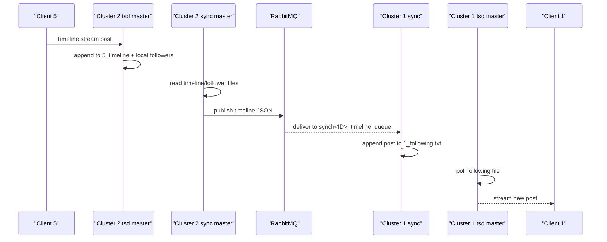

# MP2.2 Distributed SNS

This README is a deep-dive of the architecture that is implemented in this subtree (`mp2_2`) today.
It describes real behavior from the code, not an idealized design.

## What This System Is

The system is a distributed Twitter-like service with:

- one coordinator (`coordinator`) for membership, liveness, and role assignment,
- six server replicas (`tsd`), organized as two per cluster across three clusters,
- six synchronizers (`synchronizer`), organized as two per cluster,
- one RabbitMQ broker for cross-cluster asynchronous replication,
- one CLI client (`tsc`) that discovers its serving replica from the coordinator.

Cluster assignment is hard-coded everywhere as:

`cluster = ((user_id - 1) % 3) + 1`

So usernames are expected to be numeric IDs.

## High-Level Topology

```mermaid
flowchart TB
  C["Coordinator"]
  MQ["RabbitMQ"]
  CLI["Client (tsc)"]

  subgraph CL1["Cluster 1"]
    S11["tsd #1 (master or slave)"]
    S12["tsd #2 (master or slave)"]
    Y11["sync #1 (master or slave)"]
    Y12["sync #4 (master or slave)"]
    D11["cluster_1/1 (master files)"]
    D12["cluster_1/2 (slave files)"]
  end

  subgraph CL2["Cluster 2"]
    S21["tsd #1 (master or slave)"]
    S22["tsd #2 (master or slave)"]
    Y21["sync #2 (master or slave)"]
    Y22["sync #5 (master or slave)"]
    D21["cluster_2/1"]
    D22["cluster_2/2"]
  end

  subgraph CL3["Cluster 3"]
    S31["tsd #1 (master or slave)"]
    S32["tsd #2 (master or slave)"]
    Y31["sync #3 (master or slave)"]
    Y32["sync #6 (master or slave)"]
    D31["cluster_3/1"]
    D32["cluster_3/2"]
  end

  CLI -->|"GetServer(user_id)"| C
  C --> CLI

  S11 <--> C
  S12 <--> C
  Y11 <--> C
  Y12 <--> C
  S21 <--> C
  S22 <--> C
  Y21 <--> C
  S31 <--> C
  S32 <--> C
  Y31 <--> C
  Y22 <--> C
  Y32 <--> C

  Y11 <--> MQ
  Y12 <--> MQ
  Y21 <--> MQ
  Y31 <--> MQ
  Y22 <--> MQ
  Y32 <--> MQ
```



## Component Responsibilities

### `coordinator.cc`

- Tracks nodes (`zNode`) with: ID, host/port, type, cluster, heartbeat timestamp, and `isMaster`.
- Receives heartbeats from both `tsd` and `synchronizer`.
- Assigns first active node of each type in each cluster as master.
- Demotes nodes if heartbeats are stale (`> 10s`, checked every `3s`).
- Serves discovery RPCs:
  - `GetServer(user_id)`: returns master `tsd` for user's cluster.
  - `GetSlaves(cluster_id)`: returns non-master `tsd` replicas in that cluster.
  - `GetFollowerServers(user_id)`: returns synchronizers in user's cluster.
  - `GetAllFollowerServers(sync_id)`: returns all synchronizers except caller.

### `tsd.cc` (server replica)

- Implements `SNSService` (`Login`, `List`, `Follow`, `UnFollow`, `Timeline`).
- Maintains in-memory `client_db` and continuously syncs it with file-backed state.
- Sends heartbeat every 5s; heartbeat reply controls:
  - `isMaster`,
  - active storage root (`cluster_<id>/1` for master, `cluster_<id>/2` for slave).
- If master, forwards mutating RPCs (`Login`, `Follow`) to local slave replicas via `GetSlaves`.
- For timeline streaming:
  - initial fetch from `<user>_following.txt`,
  - background polling for new entries,
  - appends outgoing posts to local timeline and same-cluster followers' following files.

### `synchronizer.cc`

- Maintains heartbeat-driven master/slave role (also 5s cadence).
- Owns three RabbitMQ queues per synchronizer ID:
  - `synch<ID>_users_queue`
  - `synch<ID>_clients_relations_queue`
  - `synch<ID>_timeline_queue`
- Runs:
  - a publish loop (`run_synchronizer`) that executes every 5s,
  - one consumer thread that routes by queue name substring (`users`, `relations`, `timeline`).
- Only the synchronizer currently marked master publishes replication updates.

### `tsc.cc` (client)

- Contacts coordinator first (`GetServer`) using user ID.
- Connects to returned `tsd` endpoint and runs command loop:
  - `FOLLOW`, `UNFOLLOW`, `LIST`, `TIMELINE`.
- `TIMELINE` opens a bidirectional stream and enters continuous read/write mode.

## Control Plane Deep Dive

### 1. Registration and heartbeats

- Servers register with `type="server"` and include cluster in metadata on first heartbeat.
- Synchronizers register with `type="synchronizer"` and explicit `clusterID`.
- Coordinator stores each node under one of three cluster vectors.
- A node is considered active if:
  - `missed_heartbeat == false`, or
  - it missed but elapsed time since last heartbeat is still < 10s.

### 2. Role assignment

On heartbeat:

- existing node: timestamp refresh + missed flag reset,
- if no current master of that type exists in cluster, this node is promoted,
- new node becomes master only if no master exists yet.

### 3. Failure handling

- `checkHeartbeat()` runs every 3s.
- If `now - last_heartbeat > 10s`, coordinator marks node missed and clears `isMaster`.
- Next valid heartbeat from any replica can trigger promotion and restore service.

## Data Plane Deep Dive

### 1. Persistent state model

All data is file-backed under `cluster_<cluster_id>/<subdir>/`, where subdir is:

- `1`: node currently master,
- `2`: node currently slave.

Per-user files:

- `all_users.txt`
- `<user>_follow_list.txt`
- `<user>_followers.txt`
- `<user>_following.txt`
- `<user>_timeline.txt`

Record format for posts uses labeled lines:

- `T <timestamp>`
- `U <username>`
- `W <message>`

Named semaphores guard file access, using patterns like:

- `/<cluster>_<subdir>_all_users.txt`
- `/<cluster>_<subdir>_<user>_followers.txt`

### 2. Intra-cluster replication (`tsd` -> `tsd`)

When a master server receives `Login` or `Follow`:

1. call coordinator `GetSlaves(cluster_id)`,
2. forward same RPC to each returned slave endpoint,
3. execute local state mutation.

This keeps server replicas in a cluster approximately synchronized.

### 3. Cross-cluster replication (`synchronizer` + RabbitMQ)

Every 5s, a master synchronizer publishes:

- user catalog (`publishUserList`),
- cross-cluster follower relationships (`publishClientRelations`),
- timeline deltas (`publishTimelines`).

Consumers update local files:

- `consumeUserLists` -> `all_users.txt`,
- `consumeClientRelations` -> `<user>_followers.txt`,
- `consumeTimelines` -> followers' `<user>_following.txt`.

## End-to-End Timeline Flow (Cross-Cluster)

Example: user `5` (cluster 2) posts, user `1` (cluster 1) follows `5`.



## Runtime Process Layout

`startup.sh` launches the default topology:

- coordinator on `9000`,
- servers:
  - cluster 1: `10000`, `10003`
  - cluster 2: `10001`, `10004`
  - cluster 3: `10002`, `10005`
- synchronizers:
  - IDs `1..6` on ports `9001..9006`
  - cluster mapping by ID modulo 3.

## Build and Run

From `mp2_2`:

```bash
docker compose up -d
docker exec rabbitmq_container rabbitmq-plugins enable rabbitmq_stream rabbitmq_stream_management
docker exec -it csce438_mp2_2_container bash
```

Inside the app container:

```bash
cd /home/csce438/mp2_2
chmod +x setup.sh startup.sh stop.sh
./setup.sh
make -j4
./startup.sh
```

Stop all launched processes:

```bash
./stop.sh
```

Run a client:

```bash
./tsc -h localhost -k 9000 -u <numeric_user_id>
```

## Known Architecture Gaps (Current Code)

These are important when reasoning about behavior in demos/tests:

1. `UnFollow` is currently a stub in `tsd` and does not mutate state.
2. Cluster count and user ID model are hard-coded (3 clusters, numeric usernames only).
3. Coordinator state is in-memory only; coordinator restart loses membership/role history.
4. Synchronizer target vectors (`server_ids`, etc.) are appended each cycle without clear; this can duplicate publish targets over time.
5. Timeline record assumptions are inconsistent:
   - `tsd::appendTo` writes 3-line records,
   - `synchronizer::consumeTimelines` writes records with an extra blank line,
   - `tsd::getLastNPosts` iterates with 4-line stride.
6. RabbitMQ flow is at-least-once style with no durable idempotency keying; duplicate delivery can still produce repeated writes depending on consumer path.

## File Map

- `coordinator.cc`: control plane membership, leader assignment, discovery RPCs.
- `tsd.cc`: SNS server logic, local replication, streaming timeline delivery.
- `synchronizer.cc`: asynchronous cross-cluster replication via RabbitMQ.
- `coordinator.proto`: coordinator and synchronizer service contracts.
- `sns.proto`: client-server SNS API.
