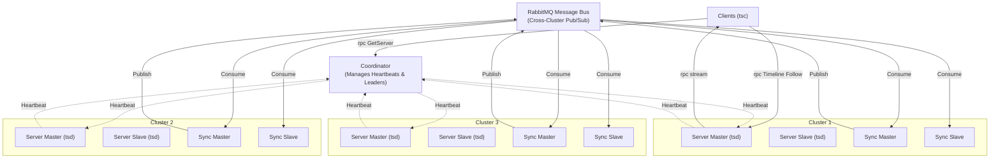
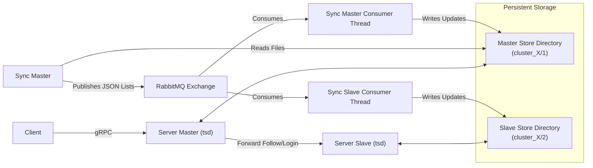
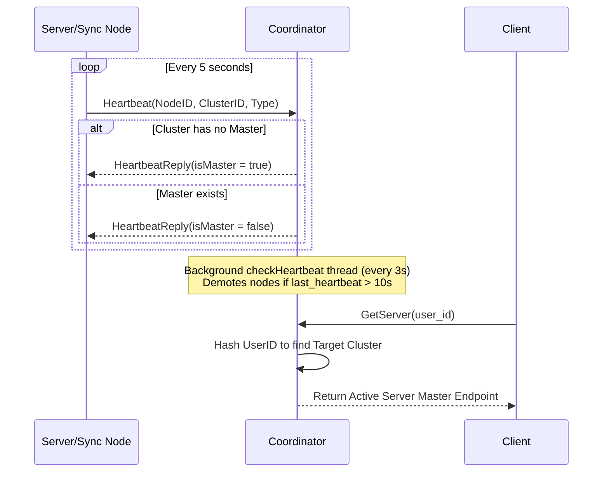
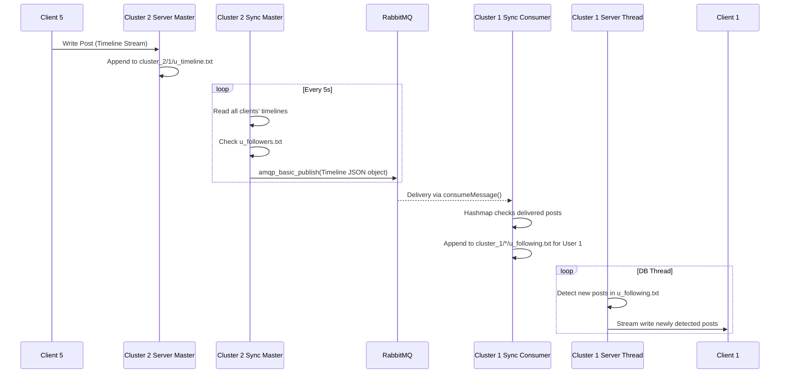
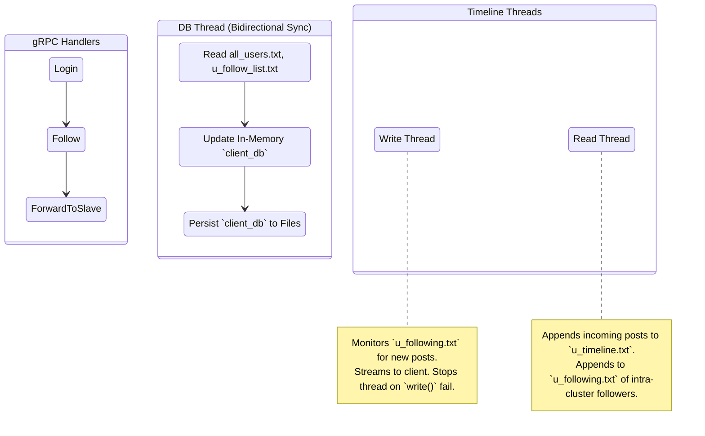

# Distributed Twitter Clone

This document describes the comprehensive architecture and system design of the distributed, fault-tolerant Twitter clone. The system leverages RPC for client-server communication, a central coordinator for cluster management, and RabbitMQ message queues for cross-cluster synchronization.

## 1) What runs in the system

- **1 Coordinator process** (`coordinator`)
- **6 Server replicas** (`tsd`), exactly 2 per cluster.
- **6 Synchronizer replicas** (`synchronizer`), exactly 2 per cluster.
- **1 RabbitMQ broker** (message bus)
- **Clients** (`tsc`) that connect to the coordinator to locate their respective cluster server.

User-to-cluster mapping is fixed via hashing:
`cluster = ((user_id - 1) % 3) + 1`

## 2) Build and Run

### Build Setup

```bash
cd mp2_2
# Assuming docker environment setup
sudo apt-get install docker-compose -y
docker-compose up -d

# Enable RabbitMQ plugins
docker exec rabbitmq_container rabbitmq-plugins enable rabbitmq_stream rabbitmq_stream_management

# Access the container
docker exec -it csce438_mp2_2_container bash -c "cd /home/csce438/mp2_2 && exec /bin/bash"

# Initial setup
chmod +x setup.sh startup.sh stop.sh
./setup.sh

# Compile
make -j4
```

To clear the directory (and remove `.txt` DB files): `make clean`

### Running the System Manually

If not using `./startup.sh`:

- **Coordinator:** `./coordinator -p 9000` _(Add `GLOG_logtostderr=1` for logs)_
- **Server:** `./tsd -c <clusterId> -s <serverId> -h <coordinatorIP> -k <coordinatorPort> -p <portNum>`
- **Synchronizer:** `./synchronizer -h <coordinatorIP> -k <coordinatorPort> -p <portNum> -i <synchID>`

Or run everything automatically:

```bash
./startup.sh
```

---

## 3) Deployment map (Macro View)



---

## 4) Intra-Cluster Architecture (Micro View)

Inside each cluster, processes are strictly divided into active **Masters** and standby **Slaves**. The Master Synchronizer is solely responsible for publishing to RabbitMQ. Both Master and Slave Synchronizers consume from RabbitMQ to keep their local file layouts synced. The Master Server forwards state-changing operations to the Slave Server.



---

## 5) Control Plane & Leader Election

The Coordinator handles dynamic assignment of `Master` and `Slave` roles using a 5-second Heartbeat mechanism.

### Heartbeat Sequence



---

## 6) Cross-Cluster Synchronization (RabbitMQ)

The **Synchronizer** daemon maintains eventual consistency across clusters. Cross-cluster data is handled using three internal publish/consume RabbitMQ queues:

1. **UserList**
2. **ClientRelations (Followers)**
3. **Timelines (Posts)**

File access inside the Synchronizer is strictly protected using named semaphores (`sem_open`).

### Timeline Replication Sequence

When User 5 (Cluster 2) posts, and User 1 (Cluster 1) is a follower:



### Queue Breakdown

#### 1. UserList Queue

- **Publisher (Sync Master):** Reads `all_users.txt` in its cluster directory. Compiles a JSON list of users and publishes it.
- **Consumer:** Reads JSON, iterates items, and appends missing users to the local `all_users.txt`.

#### 2. ClientRelations Queue

- **Publisher (Sync Master):** Reads `all_users.txt`. Iterates through all clients in its cluster. If a local client follows an external user, it compiles `{"User": ["Follower 1", "Follower 2"]}` and asks the Coordinator for target routing before publishing.
- **Consumer:** Reads JSON, finds external users and local followers, appending missing entries to `u_followers.txt`.

#### 3. Timelines Queue

- **Publisher (Sync Master):** Extracts unsynchronized posts for every local client. Checks `u_followers.txt` to find external followers. Contacts Coordinator to find target synchronization queues, then publishes JSON containing posts.
- **Consumer:** Maintains an in-memory hashmap tracking published post counts. Appends novel posts directly to the target follower's `u_following.txt` file.

---

## 7) Server Internal Architecture

The `tsd` server employs isolated threads to keep gRPC handlers unblocked:



## 8) Run layout used by startup script

- **Coordinator:** `9000`
- **Servers:**
  - Cluster 1: `10000`, `10003`
  - Cluster 2: `10001`, `10004`
  - Cluster 3: `10002`, `10005`
- **Synchronizers:**
  - IDs `1..6`, ports `9001..9006`
